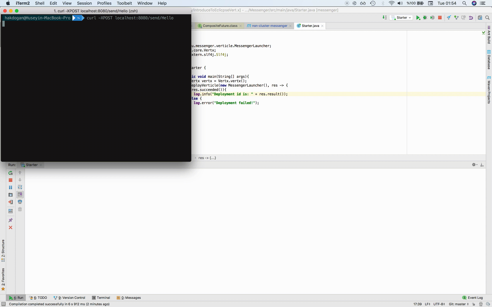

# Messenger
This example shows the use of 2 vertices communicating with each other. The messages you send with the `HTTP Post` requests over `the http://localhost:8080/send/:message` are forwarded to the receiver verticle.

## Sender
```java
   /**
     *
     * @param routingContext
     */
    private void sendMessage(RoutingContext routingContext){
        final EventBus eventBus = vertx.eventBus();
        final String message = routingContext.request().getParam(PATH_PARAM);

        eventBus.send(ADDRESS, message, reply -> {
            if (reply.succeeded()) {
                log.info("Received reply: " + reply.result().body());
            } else {
                log.info("No reply");
            }
        });
        routingContext.response().end(message);
    }
```

## Receiver
```java
    @Override
    public void start() throws Exception {
        final EventBus eventBus = vertx.eventBus();
        eventBus.consumer(ADDRESS, receivedMessage -> {
            log.debug("Received message: " + receivedMessage.body());
            receivedMessage.reply(DEFAULT_REPLY_MESSAGE);
        });

        log.info("Receiver ready!");
    }
```

## Requirements
* JDK 8 or later
* Maven 3.0.0 or later

## To compile
```
mvn celan install
```

## To run
```
java -jar target/messengerLauncher.jar
```
Or

```
sh run.sh
```

