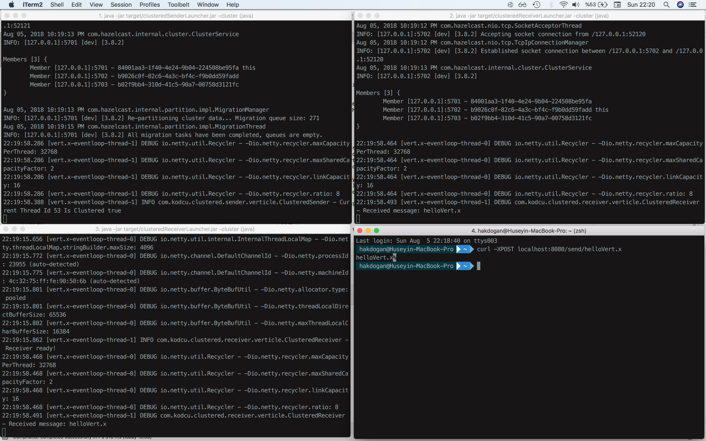

# Clustered Receiver

This example shows the use of `broadcasting messaging` in the `clustered environment`. The receiver verticle receives messages from the publisher that it's subscribed to.

```java
    @Override
    public void start() {
            final EventBus eventBus = vertx.eventBus();
            eventBus.consumer(ADDRESS, receivedMessage -> logger.info("Received message: " + receivedMessage.body()));
            logger.info("Receiver ready!");
        }

        log.info("Receiver ready!");
    }
    
```

## Requirements
* JDK 14
* Maven 3.0.0 or later
* Maven compiler plugin 3.8.0 or later
* Maven surefire plugin 

## To compile
```bash
sh compile.sh
```

## To create modular jar
```bash
sh modularJar.sh
```

## To run
```bash
java --enable-preview -p ../modularjars:modules -m receiver
```
Or

```bash
sh run.sh
```



## Relevant article is
[How to Run a Vert.x Cluster With Broadcasting Messaging](https://medium.com/@hakdogan/how-to-run-a-vert-x-cluster-with-broadcasting-messaging-fc79ff113c9c)