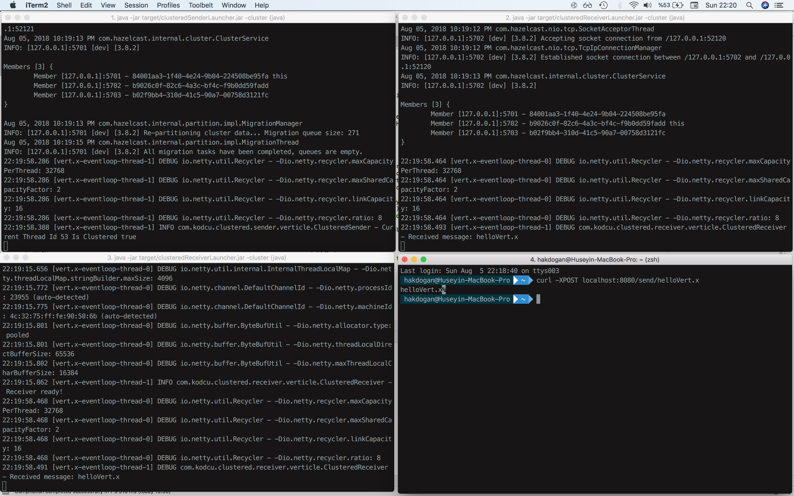

# Clustered Sender

This example shows the use of `broadcasting messaging` in the `clustered environment`. The messages you send with the `HTTP Post` requests over `the http://localhost:8080/sendForAll/:message` are forwarded to the all registered receiver.

```java
    /**
     *
     * @param routingContext
     */
    private void sendMessageForAllReceivers(RoutingContext routingContext){
        final EventBus eventBus = vertx.eventBus();
        final String message = routingContext.request().getParam(PATH_PARAM_TO_RECEIVE_MESSAGE);

        eventBus.publish(ADDRESS, message);
        logger.info("Current Thread Id " +
                Thread.currentThread().getId() + " Is Clustered  " + vertx.isClustered());
        routingContext.response().end(message);
    }
    
```

## Requirements
* JDK 14
* Maven 3.0.0 or later
* Maven compiler plugin 3.8.0 or later
* Maven surefire plugin 

## To compile
```bash
sh compile.sh
```

## To create modular jar
```bash
sh modularJar.sh
```

## To run
```bash
java --enable-preview -p ../modularjars:modules -m sender
```
Or

```bash
sh run.sh
```



## Relevant article is
[How to Run a Vert.x Cluster With Broadcasting Messaging](https://medium.com/@hakdogan/how-to-run-a-vert-x-cluster-with-broadcasting-messaging-fc79ff113c9c)
