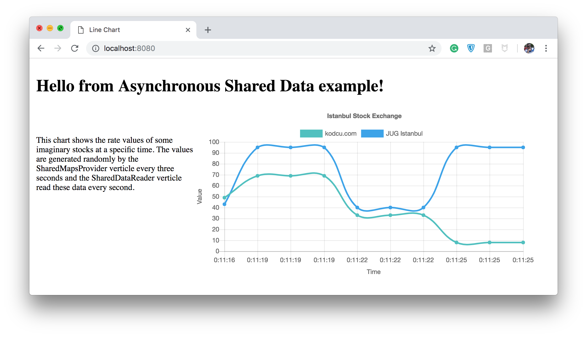

# Shared Data Reader

This example in this module shows the use of `Shared Data` via `Asynchronous Shared Maps` in `Vert.x`. The data generated by the `Shared Data Provider` app is read every second.
                                                 
```java
   SharedData sharedData = vertx.sharedData();
           sharedData.<String, StockExchange>getAsyncMap(DEFAULT_ASYNC_MAP_NAME, res -> {
               if (res.succeeded()) {
                   AsyncMap<String, StockExchange> stockExchangeAsyncMap = res.result();
                   stockExchangeAsyncMap.get(DEFAULT_ASYNC_MAP_KEY, asyncDataResult -> {
                       stockExchange = asyncDataResult.result();
                       logger.debug("Stock Exchange object is {} ", Json.encodePrettily(stockExchange));
                   });
               } else {
                   logger.debug("Something went wrong when access to shared map!");
               }
           });
```

## Requirements
* JDK 9 or later
* Maven 3.0.0 or later
* Maven compiler plugin 3.8.0 or later

## To compile
```bash
sh compile.sh
```

## To create modular jar
```bash
sh modularJar.sh
```

## To run
```bash
java -p ../modularjars:../entity/modules:../helper/modules \
 --add-modules java.se \
 --add-exports java.base/jdk.internal.ref=com.hazelcast.core \
 --add-opens java.base/java.lang=com.hazelcast.core \
 --add-opens java.base/java.nio=com.hazelcast.core \
 --add-opens java.base/sun.nio.ch=com.hazelcast.core \
 --add-opens java.management/sun.management=com.hazelcast.core \
 --add-opens jdk.management/com.sun.management.internal=com.hazelcast.core \
-m shared.data.reader
```

Or

```bash
sh run.sh
```



## Relevant article is
[How to Share Data Between Threads in Vert.x](https://medium.com/@hakdogan/how-to-share-data-between-threads-in-vert-x-afdf26dcc684)
